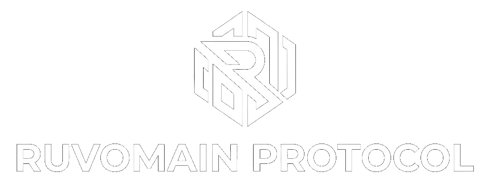

 &nbsp; 

 
<strong>Universal Protocol with Pure Bash</strong> 
<strong>Debloater and system management for</strong> 
<strong>Samsung S24+ & other Android devices.</strong>

---

<!--  --> &nbsp;  &nbsp;  &nbsp;  <!--  -->

 &nbsp;  &nbsp;  &nbsp; 

 &nbsp;  &nbsp; 

The **Ruvomain-pbd** script is a tool to surgically remove unwanted apps from Samsung and other phones without needing root access. It’s designed to be safe, clean, and keep your device integrity intact.
It's a zero-dependency, professional-grade infrastructure for system optimization. Designed for those who demand total sovereignty over their hardware, this protocol replaces bloated middleware (like Shizuku or Canta) with a 100% native Bash execution model.

[Dictionnary: Technical Context](https://github.com/Ruvyrom/Ruvomain-Protocole/blob/main/README.md#dictionnary-technical-context) 

---
### Table of Contents
**[Quick Start Guide](https://github.com/Ruvyrom/Ruvomain-Protocole/blob/main/Docs/Quick-Start-Guide.md)**

[All Documentation](https://github.com/Ruvyrom/Ruvomain-Protocole/blob/main/README.md#documentation)

[Features](https://github.com/Ruvyrom/Ruvomain-Protocole/blob/main/README.md#features)

[Technical Architecture](https://github.com/Ruvyrom/Ruvomain-Protocole/blob/main/README.md#-technical-architecture) 

[Comparaison Matrix](https://github.com/Ruvyrom/Ruvomain-Protocole/blob/main/README.md#%EF%B8%8F-comparison-matrix) 

[Proof of Concept](https://github.com/Ruvyrom/Ruvomain-Protocol/blob/main/README.md#-proof-screenshot)

[Why JSON and Pure Bash?](https://github.com/Ruvyrom/Ruvomain-Protocole/blob/main/Docs/Why-JSON-Parsing-Pure-Bash-guarantee-privacy.md#why-json-parsing--pure-bash-guarantee-privacy) 

[Community and Credits](https://github.com/Ruvyrom/Ruvomain-Protocole/tree/main#-community--credits)

[Disclaimer](https://github.com/Ruvyrom/Ruvomain-Protocole/blob/main/README.md#%EF%B8%8F-disclaimer)

[Hall of Fame](https://github.com/Ruvyrom/Ruvomain-Protocole/blob/main/README.md#hall-of-fame)

---
## Features: 
"Surgical Minimalism" is the art of achieving maximum efficiency through the smallest possible codebase. By eliminating external dependencies, we reduce the system's attack surface and ensure absolute transparency.

**Zero-Dependency:** No Java, no **Zero-Dependency:** No Java, no middleware, no pre-compiled binaries. Just pure shell.

**Auditable:** Every line of code is human-readable. You own the process from end to end.

**Autonomous:** The protocol executes, performs the surgical strike, and terminates. No resident services (daemons) remain in the background.

**Automated:**
>Automatic installation of ADB for Debian, Arch, and Fedora-based distributions, as well as for Termux 
>
>Select the list to apply (e.g., ruvomain_tier1_stable or your own file), and Ruvomain takes care of the debloating for you.

---
### 📸 Proof Screenshot
| Energy Efficiency | Low Comsumption |
| :---: | :---: |
|  |  |
| 10h+ SOT achieved on a S24+ Exynos. Proving that the Ruvomain Protocol Optimize battery life | Low energy consumption in standby mode |

| Resource Management | Connectivity |
| :---: | :---: |
|  |  |
| Optimized background processes in RAM. | The CPU is not overloaded, which limits heat generation and allows for a deep sleep state. |

---
## 🚀 Technical Architecture

The core of **Ruvomain-PBD** is `json-walk`, an event-driven (SAX-style) parser written in pure Bash. It processes your configurations natively, ensuring compatibility across Linux, Termux, and Android without requiring external binaries like `jq`.

---
## ⚖️ Comparison Matrix

| Feature | Standard Approach (Canta/Shizuku)| **Ruvomain-PBD** |
| :--- | :--- | :--- |
| **Dependencies** | Java, Shizuku, Canta, `jq` | **None (Zero-Dependency)** |
| **Memory Footprint** | Permanent (Active service) | **None (One-time execution)** |
| **Auditability** | Limited (Black-box) | **Total (Native Bash)** |
| **Complexity** | High(Multi-layered) | **Minimalist (Surgical)** |

---
## Contributing

<b>You have a specific device? Create your JSON profile </b>

Fork this repo, place it in `/Configs/Imports`, and submit a Pull Request. Your configuration will then be available to the entire community.
Create a JSON file [following the protocol schema](https://github.com/Ruvyrom/Ruvomain-Protocole/blob/main/Configs/Imports/structure-example.json). More information [here](https://github.com/Ruvyrom/Ruvomain-Protocole/blob/main/Configs/Imports/README.md).*

<b>Need help with your first contribution ? </b>

  
Need help with your first contribution? [Consult this guide](https://github.com/firstcontributions/first-contributions) to learn the basics of pull requests.

---
## Documentation
To gain a deeper understanding of the technical and operational aspects of the protocol, please refer to the following files located in the `/Docs` directory:

- [Protocol Hierarchy](/Docs/Protocol-Hierarchy.md) (3 tiers packages list exemple for S24+)
>An overview of the protocol's global architecture.

<!--- [Using the Makefile](/Docs/Using-the-Makefile.md)
>A comprehensive guide to the secure control interface.-->

- [JSON files importation](/Configs/Imports/README.md)
>How to import your personnal .json list files (for S24+ or other devices) for using with Ruvomain-pbd script.

- [Network & Resource Confinement](/Docs/Network-&-Resource-Confinement-Layers.md)
>Technical details on system hardening and resource management.

- [Package List](Docs/package-list.md) (S24+)
>A detailed list of components targeted by the protocol.

- [Replacement](/Docs/Remplacement.md)
>Documentation regarding software substitution processes and procedures.Users on different hardware or firmware versions should exercise caution and verify package dependencies before execution.

- [Interface Setup](/Docs/Interface-Setup.md)
>A guide to achieving an AOSP-like aestheticand maximum operational efficiency while retaining native Samsung system optimizations.

- [Monitoring Strategy](/Docs/Monitoring-Strategy.md)
>Methodologies for analyzing system behavior, battery drain, and network telemetry to maintain long-term stability.

- [Safety & Auditing](Docs/Safety-&-Auditing.md)
>Information regarding code transparency, audit processes, and system integrity maintenance.

---
### 👥 Community & Credits
For support, discussions, and the latest news on the Ruvomain Protocol, join our Community on:
[Reddit](https://www.reddit.com/r/Ruvomain/s/9HlpNjl2M7)

*   "100% Bash Parser for JSON" - thanks to [smmoosavi](https://github.com/smmoosavi/json-walk) for json-walk.
*   **Validation:** Rigorous cross-verification with [Willie_169](https://github.com/Willie169).
*   **Community Testing:** Special thanks to @ric69 for empirical field-testing of Tier 1 stability.

---
### Dictionnary: Technical Context

<b>⚙️ What is ADB? (Forbeginners)</b>

ADB (Android Debug Bridge) is the core command-line utility that creates a bridge between your computer and your phone’s operating system.

For the Ruvomain Protocol, ADB is our primary "privileged channel." It allows us to execute shell commands and surgically modify system packages—all <b>without root access</b>. This is critical for ourapproach: it lets us strip out bloatware and reclaim device sovereignty while keeping the system’s native security integrity and Samsung Knox completely intact.

<b>🐚 What is Bash? (Why we use it)</b>

Bash is the scripting language that powers the Ruvomain Protocol. We chose it for one reason: <b>transparency</b>. Unlike closed-source tools that hide their logic in a "blackbox," our Bash scripts are written in plain, readable text. This means you can personally audit, verify, and understand every single command before it touches your device. It is the foundation of a truly trust-based and auditable system.

<b>📄 What is JSON? (Our configuration layer)</b>

JSON acts as our "configuration layer." It is a simple, human-readable format that holds the data for the protocol, essentially acting as a map that tells the scripts exactly which packages to target. By separating our data (the JSON files) from our logic (the Bashscripts), we keep the protocol modular and incredibly easy to customize. You don't need to be a coder to manage these lists; you just need to edit the map.

<b>🔄 What is Git? (Why it matters)</b>

Git is our "version control" system. Think of it as a time machine for the RuvomainProtocol. Every change, improvement, or optimization we make is recorded in the project's history. This allows us to track exactly howthe protocol evolves, roll back to previous versions if needed, and ensures that the project remains a transparent, collaborative, and living system—notjust a static file.

---
## ✅ Current Status:
Stable environment. No critical system crashes or UI stutters detected in daily driving.

## ⚠️ Disclaimer
*I am not responsible for any issues resulting from system modifications. Always perform a data backup before deployment.*

### 🏆 Hall of Fame
* **Institutional Censorship:** Term "Ruvomain" filtered on XDA; posting rights revoked on r/androidroot; Banned from posting and commenting on r/GalaxyS24; A majority of my posts removed from r/degoogle.
* **Diagnosis:** The protocol's surgical efficiency threatens the root-dependency paradigm. We don't ask for permission to optimize; we just do it.

---
Got questions? Reddit is the place to discuss builds.
>[r/Ruvomain](https://www.reddit.com/r/Ruvomain/s/9HlpNjl2M7)

---
*My other project on github for [Google Pixel6, LineageOS Vanilla 23.2](https://github.com/Ruvyrom/Ruvyrom/tree/main)*
