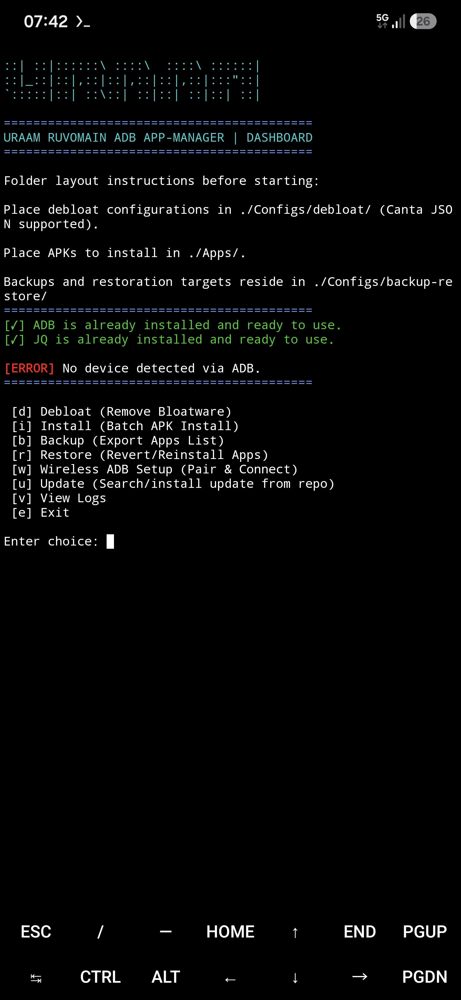
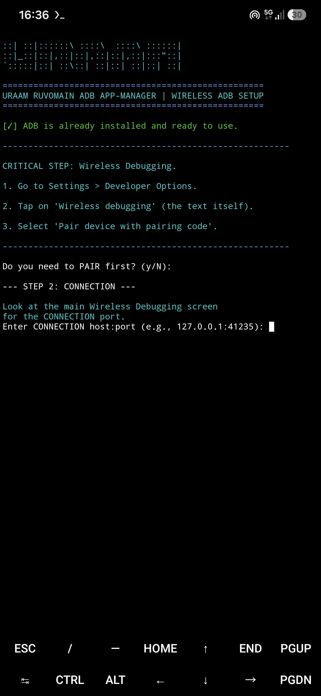
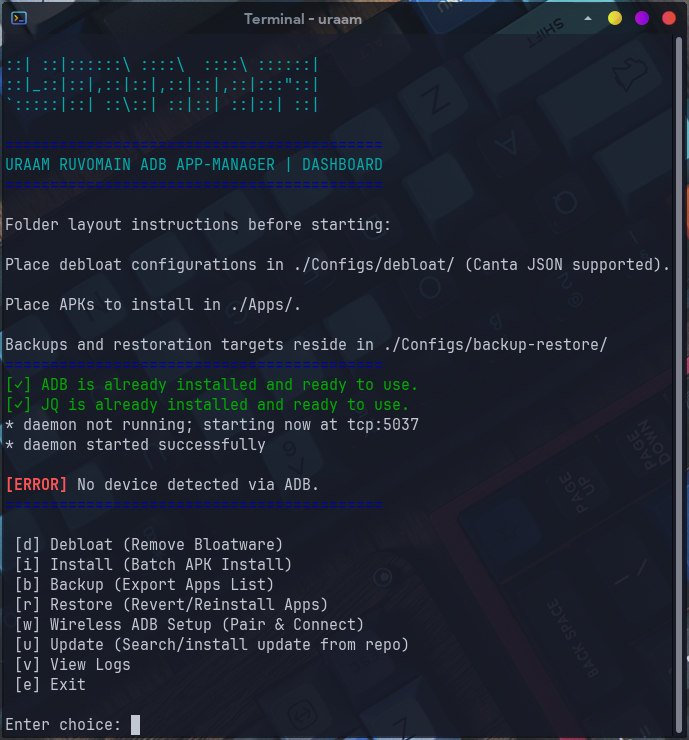

<p align="center">
 &nbsp; 
</p>

<div align="center" style="background-color: #151B22; display: inline-block">

<br>
<strong>[URAAM]-Universal Ruvomain ADB App-Manager</strong>
<em><br>Debloat, Restore, Backup list [json files] and APK Installer</strong><br>
<strong>For ALL Android devices and compatible with root, Shiziku rish and wireless ADB in Termux & Linux, MacOS, WSL</strong></em>
</div>

&nbsp;
<p align="center">
 &nbsp;
 &nbsp;

 &nbsp; 
 &nbsp; 

  &nbsp;
  &nbsp;
 &nbsp;
 &nbsp;
 &nbsp;
 &nbsp;
 &nbsp;
 &nbsp;

</p>

<div align="center">
<p>
<strong>
The UNIVERSAL RUVOMAIN ADB APP-MANAGER (URAAM) is a terminal toolkit to safely debloat unwanted apps, restore uninstalled apps, backup configurations into structured JSON files and batch-install personal APKs across any Android device without requiring root access.. Compatible with all Android phones without needing root access via ADB. It’s designed to be safe, clean, and keep your device integrity intact.
Professional-grade infrastructure forsystem optimization. Replace heavy middleware with a native, audited Bash + jq pipeline. Fully compatible with Canta/UAD JSON lists out of the box.</em>
</p>
<p>
<em>« I'm not imposing anything on you: I provide infrastructure, you bring your data, and you execute code that you can read. »</em>
</p>
</div>

| <div align="center">Termux</div> <div align="center"></div> |  <div align="center">Dashboard</div> |  <div align="center">Wireless ADB</div> || <div align="center">Linux</div> <div align="center"></div> |  <div align="center">Dashboard</div> |
| :--- | :--- | :--- | :--- | :--- | :--- |

> **🚀 Latest Updates:**
>
> * ***v.4.2.0***
>>* *You can install URAAM now in Termux with uuram-termux_4.2.0_all.deb*
>>* *Integrated Auto-Updater, One-Line Installer, Improvements.*
> * ***v4.0/v4.1***
>>* ***Major Refactoring:** Unified suite bundled into a single zero-overhead master engine: `uraam.sh`.*
>>* ***Curated Presets:** Added curated debloat configurations in [`./Configs/debloat`](https://github.com/Ruvyrom/Uraam/tree/main/Configs/debloat) (Samsung OneUI, Xiaomi HyperOS, Vivo/iQOO, TCL Android TV, Meta preinstalled daemons & Carrier bloatware).*
>---

## ⚡ Core Features

* 🗑️ **Debloat (JSON-Powered):** Safely remove or disable bloatware using community-driven Canta & UAD JSON lists.
* 📦 **Batch APK Installer:** Drop your APKs into `./Apps/` and install them all in one click with automatic handling.
* 💾 **Smart Backup (JSON):** Export your current device state and package configuration to a portable JSON file.
* 🔄 **Restore (JSON-Driven):** Revert uninstalled apps or reinstall packages seamlessly from previous backups.
* 📶 **Wireless ADB Assistant:** Built-in pairing & connection helper for seamless PC-free or cable-free setup.
* 🚀 **Self-Updater:** Keep URAAM up to date directly fromthe official repository with a single keypress.
* 📜 **Integrated Logs Viewer:** Inspect terminal history and debug operations instantly without leaving the dashboard.

## 🚀 Ready to deploy?

**UNIVERSAL RUVOMAIN ADB APP-MANAGER (URAAM):**

**1-USB option** ***Enable USB Debugging on your device:***

* Settings > About phone > Tap "Build Number" 7 times

* Settings > Developer Options > Enable "USB Debugging"

* Connect your device to your PC via USB

or

**2-Wireless option** ***Use wireless ADB setup assistant option in Dashboard.***
* Execute script and choose option ***[w] Wireless ADB Setup***
* Follow instructions.

or

**3-Shizuku option** ***(For Termux via Shizuku & Rish):***
* Start [Shizuku](https://shizuku.rikka.app/).
* Export the Shizuku shell (`rish`) into Termux environment.
* URAAM will execute elevated package commands directly on-device.

### 📁 File Layout (`~/.Uraam/`)
| Folder | Purpose|
| :--- | :--- |
| `Configs/debloat/` | Place debloat lists here (*Canta/UAD, raw JSON supported*) |
| `Apps/` | Place APKs to batch-install |
| `Configs/backup-restore/` | Exported application lists & restore points |

### Direct execution
**1-Line Installation**

* Auto-install with confirmation on **Termux, Linux, macOS, WSL**:
```bash
bash <(command -v curl >/dev/null && curl -fsSL https://raw.githubusercontent.com/Ruvyrom/Uraam/main/installer.sh || wget -qO- https://raw.githubusercontent.com/Ruvyrom/Uraam/main/installer.sh)
```

DEB installation for Debian with uraam-debian_*.deb**
```bash
curl -LO https://github.com/Ruvyrom/Uraam/releases/download/v4.2.0/uraam-termux_4.2.0_all.deb 
sudo dpkg -i install ./uraam-debian_4.2.0_all.deb
```

**DEB installation fo installation with uraam-termux_*.deb**
```bash
curl -LO https://github.com/Ruvyrom/Uraam/releases/download/v4.2.0/uraam-termux_4.2.0_all.deb 
pkg install ./uraam-termux_4.2.0_all.deb
```

> * **Note :**
>> * *The installer auto-install GIT after confirm and takes care of cloning the repository.*
>> * *URAAM auto-install ADB and JQ if necessary.*
>> * *DEB packages install dependencies*

### Usage Anywhere

Once installed, simply run the global command from any directory:
```bash
uraam
```
📖 For platform-specific documentation (Termuxstandalone, macOS, WSL2, Linux rules), refer to the **[URAAM - Quick Start Guide](Docs/Quick-Start-Guide.md)**.
Discover all Makefile targets using `make help`.

---
## Dictionary: Technical Context
<details>
<summary><b>⚙️ What is ADB? (Forbeginners)</b></summary>

ADB (Android Debug Bridge) is the core command-line utility that creates a bridge between your computer and your phone’s operating system.

For URAAM, ADB is our primary "privileged channel." It allows us to execute shell commands and surgically modify system packages—all <b>without root access</b>. This is critical for our approach: it lets us strip out bloatware and reclaim device sovereignty while keeping the system’s native security integrity and Samsung Knox completely intact.
</details>

<details>
<summary><b>🐚 What is Bash? (Why we use it)</b></summary>

Bash is the scripting language that powers URAAM. We chose it for one reason: <b>transparency</b>. Unlike closed-source tools that hide their logic in a "blackbox," our Bash scripts are written in plain, readable text. This means you can personally audit, verify, and understand every single command before it touches your device. It is the foundation of a truly trust-based and auditable system.
</details>

<details>
<summary><b>📄 What is JSON? (Our configuration layer)</b></summary>

JSON acts as our "configuration layer." It is a simple, human-readable format that holds the data for the protocol, essentially acting as a map that tells the scripts exactly which packages to target. By separating our data (the JSON files) from our logic (the Bashscripts), we keep the protocol modular and incredibly easy to customize. You don't need to be a coder to manage these lists; you just need to edit the map.
</details>

<details>
<summary><b>🔄 What is Git? (Why it matters)</b></summary>

Git is our "version control" system. Think of it as a time machine for URAAM. Every change, improvement, or optimization we make is recorded in the project's history. This allows us to track exactly how the protocol evolves, roll back to previous versions if needed, and ensures that the project remains a transparent, collaborative, and living system—not just a static file.
</details>

---
## ⚖️ Comparison Matrix

| Feature | Standard Approach (Canta/Shizuku)| **URAAM** |
| :--- | :--- | :--- |
| **Dependencies** | Java, Shizuku, Canta | **jq** |
| **Memory Footprint** | Permanent (Active service) | **None (One-time execution)** |
| **Auditability** | Limited (Black-box) | **Total (Native Bash)** |
| **Complexity** | High (Multi-layered) | **Minimalist (Surgical)** |

---
## 👥 Contributing

**You have a specific device? Create your JSON file list or import Canta/UAD and raw packages list!**

Fork this repo, place it in `/Configs/debloat`, and submit a Pull Request. Your configuration will then be available to the entire community.
To create your JSON list file or import Canta backup [following the contributing guide](Configs/debloat/README.md).

>**Need help with your first contribution?** *[Consult this guide](https://github.com/firstcontributions/first-contributions) to learn the basics of pull requests.*

---
## 📖 Documentation
To gain a deeper understanding of the technical and operational aspects of the protocol, please refer to the following files located in the `/Docs` directory:

<details>
<summary><b>Click to view documentation</b></summary>

>[URAAM Hierarchy](/Docs/Uraam-Hierarchy.md) (3 tiers packages list exemple for S24+)

>>An overview of the Uraam's global architecture.

>[JSON files importation](/Docs/structure-example.json)

>>How to import your personnal .json list files for using with URAAM script.

>[Network & Resource Confinement](/Docs/Network-&-Resource-Confinement-Layers.md)

>>Technical details on system hardening and resource management.

>[Package List](Docs/Tiers-list.md) (S24+)

>>A detailed list of components targeted by the protocol.

>[Replacement](/Docs/Remplacement.md)

>>Documentation regarding software substitution processes and procedures.Users on different hardware or firmware versions should exercise caution and verify package dependencies before execution.

>[Interface Setup](/Docs/Interface-Setup.md)

>A guide to achieving an AOSP-like aestheticand maximum operational efficiency while retaining native Samsung system optimizations.

>>[Monitoring Strategy](/Docs/Monitoring-Strategy.md)

>Methodologies for analyzing system behavior, battery drain, and network telemetry to maintain long-term stability.

>[Safety & Auditing](Docs/Safety-&-Auditing.md)

>>Information regarding code transparency, audit processes, and system integrity maintenance.
</details>

---
### 👥 Credits

*   Package definitions and safe removal classifications adapted from [Universal Android Debloater Next Generation (UAD-NG)](https://github.com/Universal-Debloater-Alliance/universal-android-debloater-next-generation).
*   "100% Bash Parser for JSON" - thanks to [smmoosavi](https://github.com/smmoosavi/json-walk) for json-walk.
*   Thanks to [Dyokism](https://github.com/dyokism) for code contribution.
*   **Validation:** Rigorous cross-verification with [Willie_169](https://github.com/Willie169) and OneUI 8.0 JSON config file.
*   **Community Testing:** Special thanks to @ric69 for empirical field-testing of Tier 1 stability.

---
## ✅ Current Status:
Stable environment. No critical system crashes or UI stutters detected in daily driving.

## ⚠️ Disclaimer
*I am not responsible for any issues resulting from system modifications. Always perform a data backup before deployment.*

---
*My other project on github for [Google Pixel6, LineageOS Vanilla 23.2](https://github.com/Ruvyrom/Ruvyrom/tree/main)*


